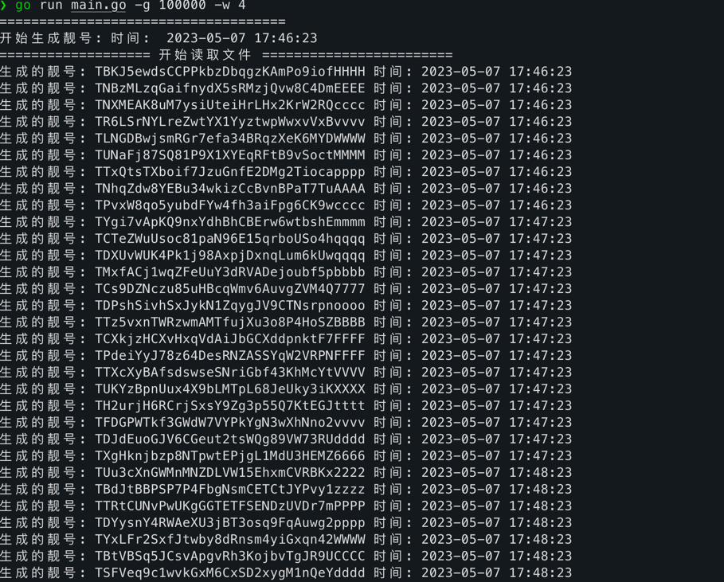

## batch_generate_tron_address

go写的波场靓号批量生成工具。

分为两个版本： 体验版 ｜ 提速版


####  提速版: 可离线断网批量生成波场地址靓号，每秒生成地址可达5000万左右
####  体验版: 可离线断网批量生成波场地址靓号，每秒生成地址1个

#### 体验版
windows
```cmd
batch_generate_windows_tiyanban // 后四位连号
```

mac
```vim
./batch_generate_mac_tiyanban // 后四位连号
```

linux
```vim
./batch_generate_linux_tiyanban // 后四位连号
```


#### 提速版 通过下方联系方式获取

1. 通过match.txt格式配置需要的靓号， 格式非常简单

2. 速度可配置:  -g 配置的协程数量，越高速度越快.  - w 后几位连号

    Mac
   ```vim
   ./batch_generate_mac -g 1000000 -w 4 // 后四位连号
   ./batch_generate_mac -g 1000000 -w 6 // 后六位连号
   ```
   
    windows
    ```cmd
    batch_generate_windows -g 1000000 -w 4 // 后四位连号
    batch_generate_windows -g 1000000 -w 6 // 后六位连号
    ```
   
   linux
   ```vim
   batch_generate_linux -g 1000000 -w 4 // 后四位连号
   batch_generate_linux -g 1000000 -w 6 // 后六位连号
   ```


3. 符合连号的地址会写进文本文件 如四位靓号，写进 `4位靓号.txt`

4. 文件里带波场地址和私钥

5. 本程序不调用任何外用接口，不将私钥做任何保存

效果:


6. 需要Mac、windows、linux程序的可以通过以下联系方式获取

Telegram: https://t.me/laomaok

weixin: laomao12a
